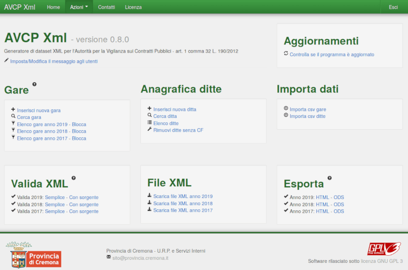

# AVCP-Xml - Repository di sviluppo
Generatore di dataset XML per l'Autorità per la Vigilanza sui Contratti Pubblici - art. 1 comma 32 L. 190/2012

**Attenzione**, a meno che non siate sviluppatori interessati a contribuire al progetto, vi consigliamo di scaricare sempre l'[ultima release stabile disponibile](https://github.com/provinciadicremona/AVCP-Xml/releases/latest).

## Screenshots

## Upgrade dalla versione 0.7.1
Per aggiornare il programma, [scaricare la release più recente](https://github.com/provinciadicremona/AVCP-Xml/releases/latest) e seguire le istruzioni riportate di seguito.

## API per l'ultima versione disponibile
`https://api.github.com/repos/provinciadicremona/AVCP-Xml/releases/latest`

## Compatibile con la versione 1.3 delle specifiche tecniche ANAC per l'anno 2020
Il 4 novembre 2019, l'ANAC ha introdotto [una nuova versione dei file xsd non retrocompatibili](http://www.anticorruzione.it/portal/public/classic/Servizi/ServiziOnline/DichiarazioneAdempLegge190) introducendo nuove tipologie e modificando alcune di quelle esistenti.

I nuovi formati dovranno essere utilizzati a partire dalla rilevazione relativa ai lotti dell'**anno 2019**.

## Limitazioni del programma
Attualmente il programma non consente di:

* Importare file XML;
* Gestire la creazione di file indice per xml superiori ai 5Mb
